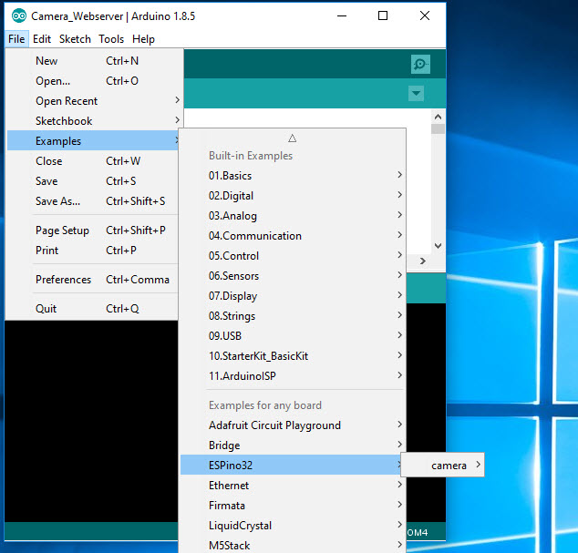

# ESPino32 Library 
ESPino32 Library คือ Library ต่างๆที่นำมาใช้งานกับบอร์ด [ESPino32](http://thaieasyelec.com/products/development-boards/arduino/espino32-wifi-development-board-detail.html)

# Thank reference code from
* [esp32-cam-demo](https://github.com/igrr/esp32-cam-demo)
* [M5Stack](https://github.com/m5stack/M5Stack)

## วิธีติดตั้ง ESPino32 
*   ติดตั้งและใช้งาน ESPino32 กับ Arduino IDE เบื้องต้น --> [ESPino32 Manual](http://thaieasyelec.com/downloads/ETEE061/ESPino32_User_Manual_TH.pdf)
* Cone or Download  ESPino32 Library 
* Copy Folder ESPino32 to --> C:\Users\<username>\Documents\Arduino\libraries
* Open ArduinoIDE 
* ไปที่เมนู File --> Examples จะพบว่ามีตัวอย่าง Code ของ ESPino32 ปรากฏขึ้นมาดังรูป

#### ตัวอย่างการใช้งาน Library               
+ ESPIno32 กับ Camera Exp.
    + [WebServer](docs/CameraExpServer.md)
    + [TFT LCD(ILI9341) Live View](docs/LiveView.md)  
    + [LINE Notify (Picture,Message,Sticker](http://thaieasyelec.com/article-wiki/embedded-electronics-application/capture-and-send-photo-message-to-line-notify-using-espino32-esp32-and-camera-expansion.html)

