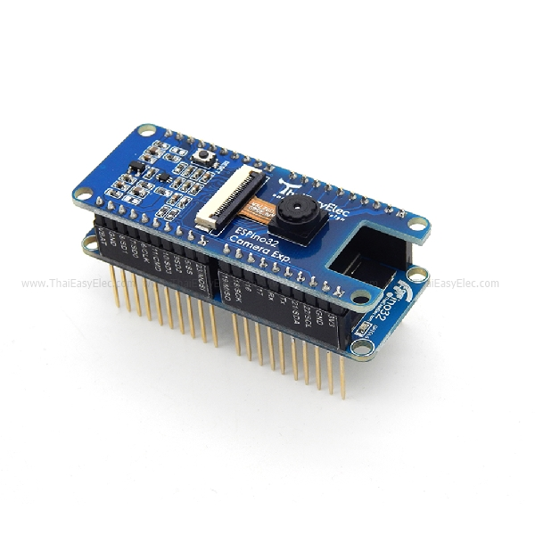
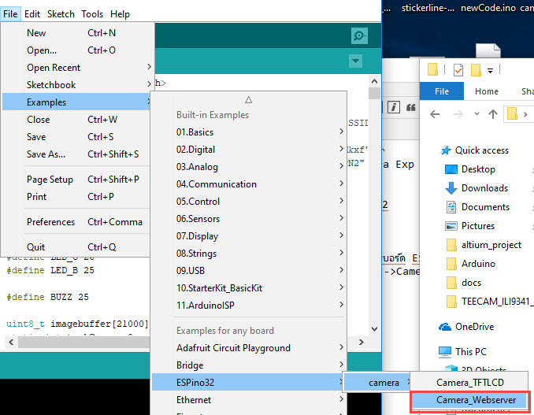
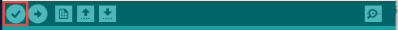
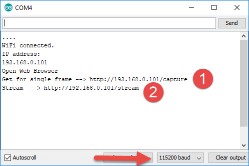
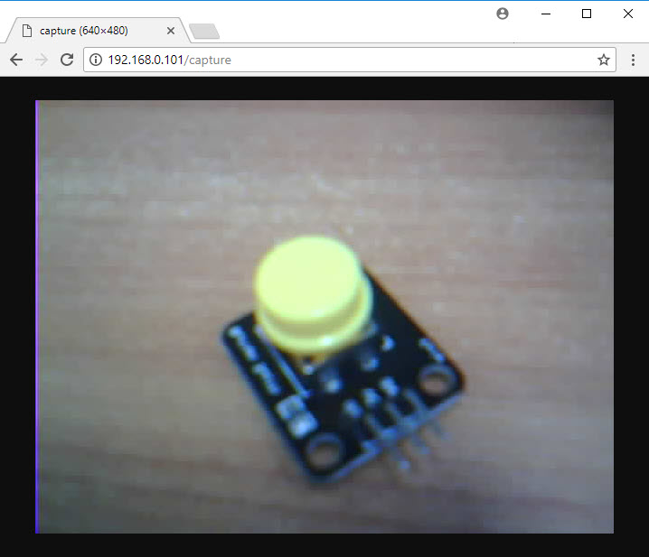

# Example  Camera Exp Web Server
ตัวอย่างการใช้งาน ESPIno32 ร่วมกับ Camera Exp โดยให้บอร์ด ESPino32 เชื่อมต่อเข้ากับ Access point แล้วสร้าง WebServer ขึ้นมา แล้วแสดงภาพที่ถ่ายจากกล้องบน Camera Exp ให้แสดงภาพบน web browser

* เชื่อมต่อ Camera Exp เข้ากับ ESPIno32

* Download และ ติดตั้ง Library สำหรับบอร์ด ESPIno32 [Download and Insatll](https://github.com/ThaiEasyElec/ESPino32)
* ไปที่ File-->Example-->ESPIno32-->Camera-->Camera_Webserver



* ตั้งค่าชื่อของ ssid และ password ของ AP ที่ต้องการให้ ESPino32 เข้าไปเชื่อมต่อ
```
char ssid[] = "yourNetwork";      // <-- your network SSID (name)
char pass[] = "secretPassword";   // <-- your network password
```
* โปรแกรมCodeลงไปบนบอร์ด



* เปิด SerialMonitor ขึ้นมา


* ตั้งค่า Baudrate = 115200 



* ที่ SerialMonitor จะแสดง URL สำหรับแสดงภาพบน Web browser โดย

```
http://xxx.xxx.xxx.xxx/capture -->สำหรับถ่ายภาพและแสดงผลแค่ครั้งเดียว
http://xxx.xxx.xxx.xxx/stream  -->สำหรับถ่ายภาพและแสดงผลแบบต่อเนื่อง

```

* ตัวอย่างภาพจากกล้อง


 
